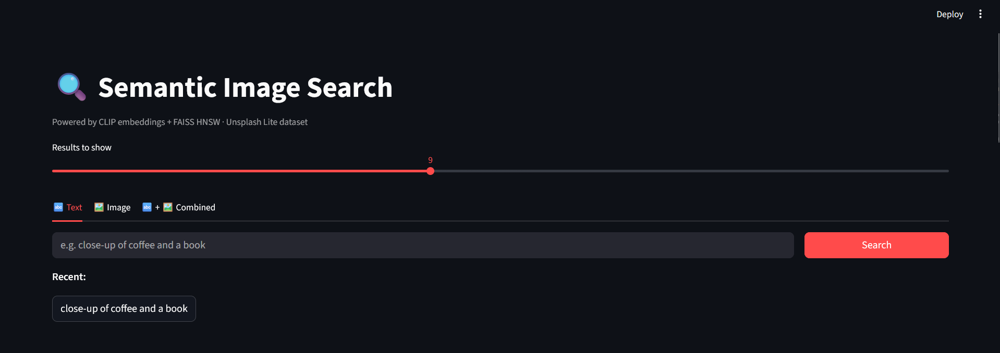
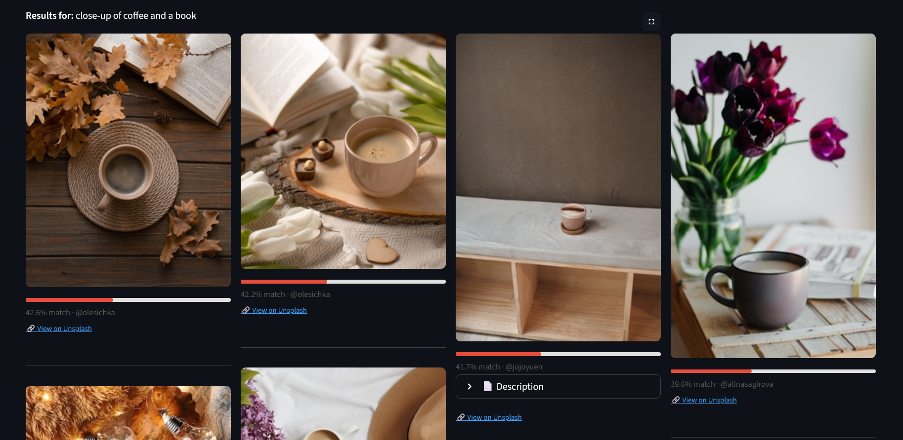
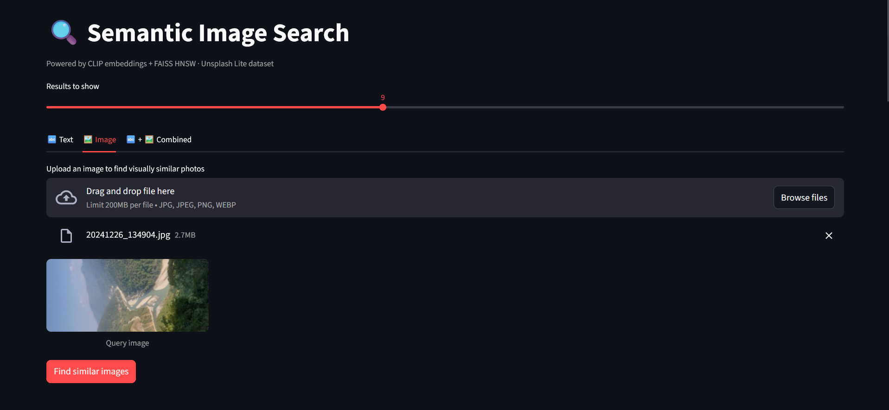
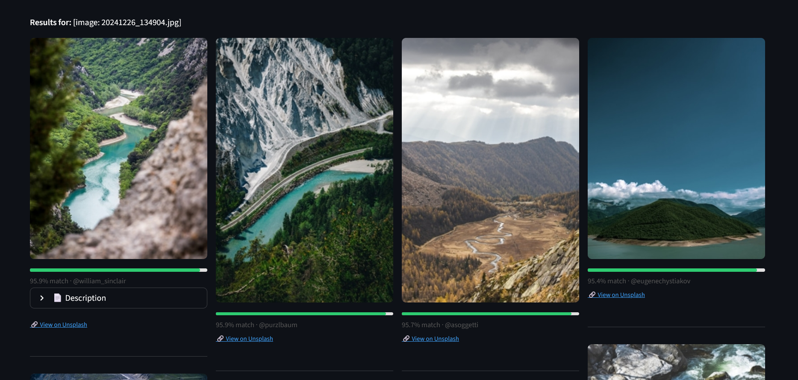
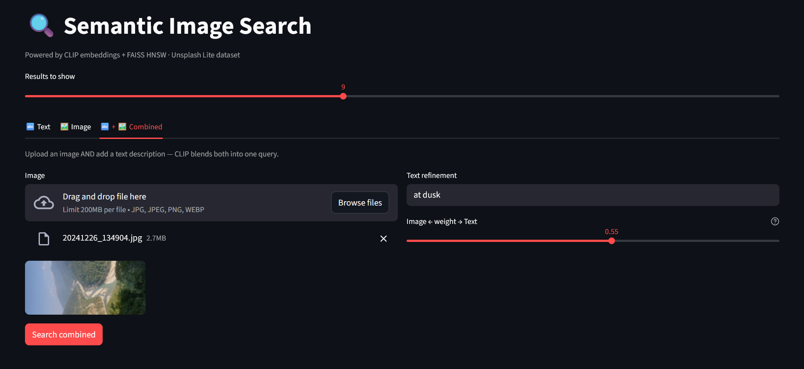
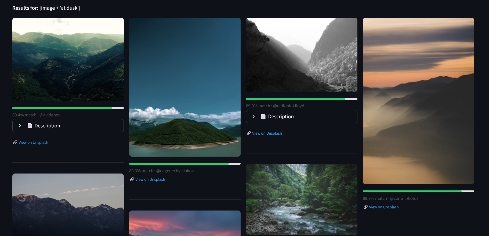

# image-search

Semantic image search over 25,000 Unsplash photos — search by text, image, or both combined, with cosine similarity scores shown per result.

## Overview

Photos from the Unsplash Lite dataset are pre-encoded into 768-dimensional CLIP vectors and stored as `.npy` + `.faiss` files — zero indexing cost at query time. At search time, your query (text, image, or a weighted blend of both) is encoded by the same CLIP model and matched against the index via FAISS HNSW cosine similarity. Results are displayed in a 4-column grid with a colour-coded similarity bar per photo.

## How it works

**Text search**
```
Text query → CLIP text encoder → 768-dim vector → FAISS HNSW → top-k results
```

**Image search**
```
Uploaded image → CLIP image encoder → 768-dim vector → FAISS HNSW → top-k results
```

**Combined search**
```
Image vector × (1 - α) + Text vector × α → normalise → FAISS HNSW → top-k results
```

## Features

- **Three search modes** — text query, image upload, or combined with a weighted alpha slider (e.g. "this image but at dusk")
- **CLIP `clip-vit-large-patch14`** — the larger ViT-L variant for higher-quality embeddings vs the base model
- **FAISS HNSW index** — pre-built offline, approximate nearest-neighbour search over 25k vectors at query time
- **Similarity scores** — colour-coded bar per result (35–55% is the natural CLIP range for text queries; image-to-image scores reach 90–95%+)
- **Search history chips** — recent text queries shown as clickable chips; empty query falls back to an example prompt
- **Unsplash metadata** — photographer attribution, expandable description, and direct "View on Unsplash" link per result
- **Adjustable result count** via slider

## Tech stack

- Python 3.11, Streamlit
- `transformers` (HuggingFace) — CLIP `clip-vit-large-patch14`
- `faiss-cpu` — HNSW index for cosine similarity search
- pandas, Pillow
- Unsplash Lite dataset (~25k photos with descriptions and alt text)

## Getting started

```bash
git clone https://github.com/shashwatsrv/image-search.git
cd image-search
uv sync
uv run streamlit run app.py
```

> Requires [uv](https://github.com/astral-sh/uv). First run will download CLIP weights (~350MB) — subsequent runs load from cache.

---

## Demo

### Text search





### Image search

Upload any photo to find visually similar results. Image-to-image similarity scores are significantly higher (90–95%+) than text queries since both query and index live in the same embedding space.





### Combined search

Upload an image and add a text refinement — CLIP blends both vectors using the alpha slider. At α = 0.55, text carries slightly more weight than the image.




